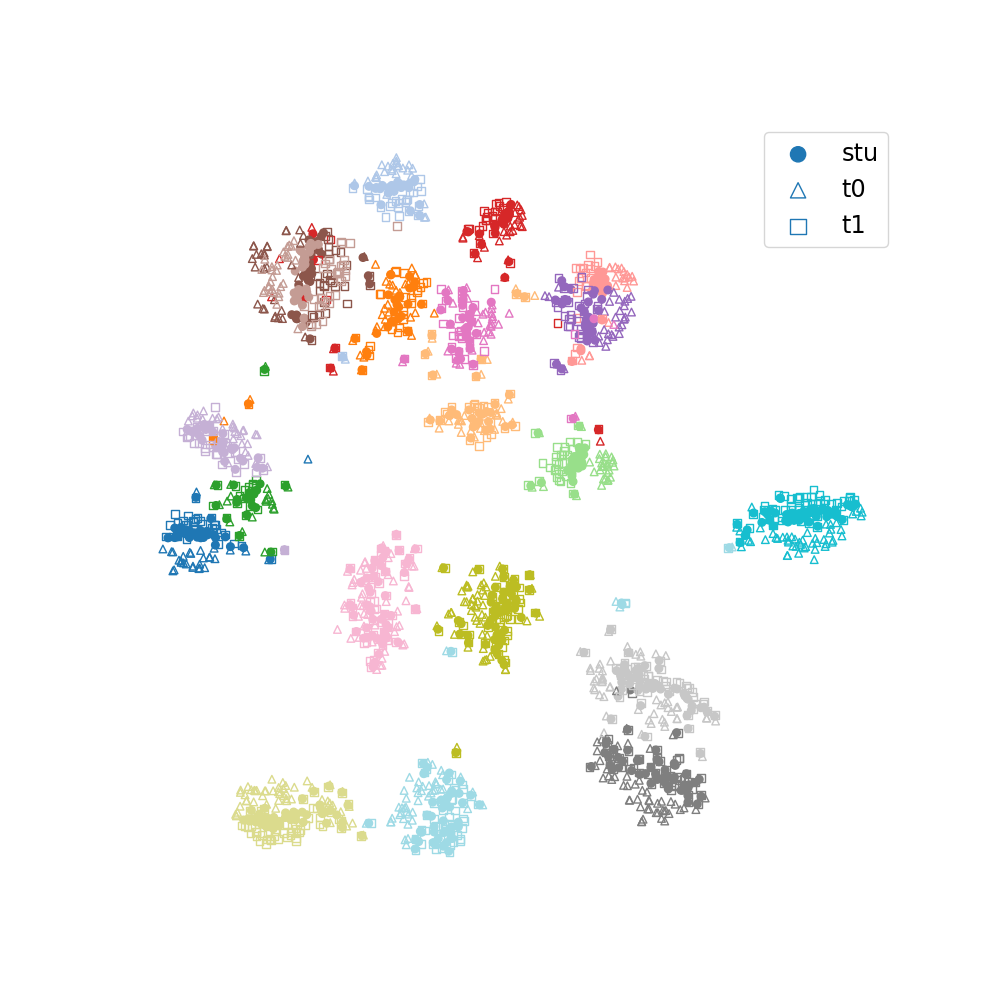
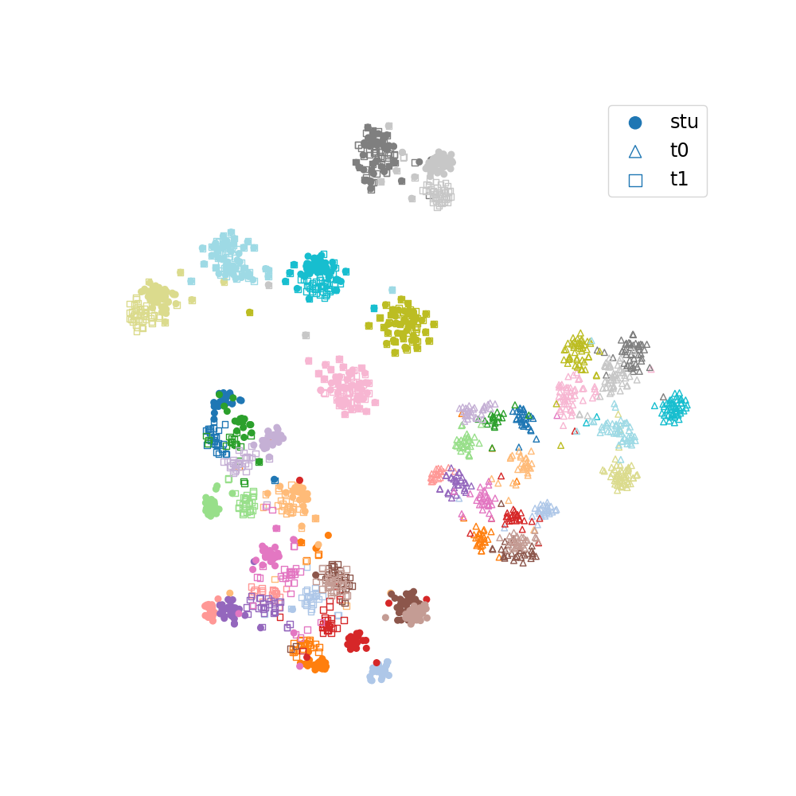
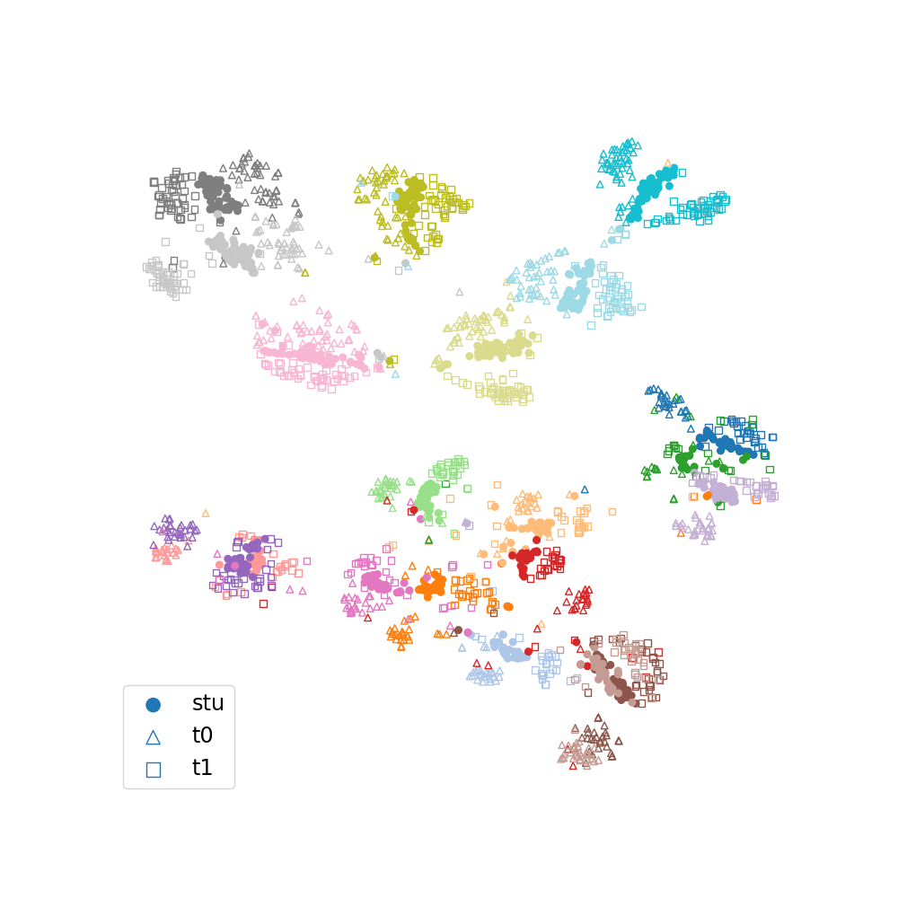
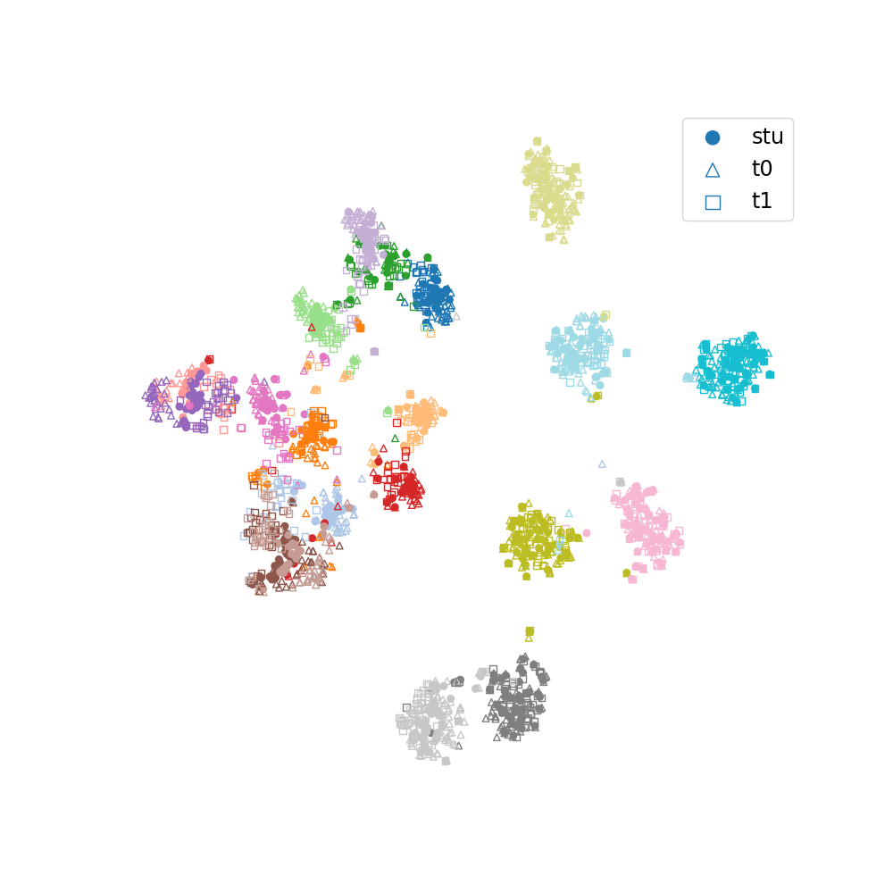

# Common Feature Learning
Unofficial implementation of [Knowledge Amalgamation from Heterogeneous Networks by Common Feature Learning](http://arxiv.org/abs/1906.10546) (*IJCAI 2019*)

## Results

### Teacher Performance
Teacher Model   |        Dataset     |    num_classes       |    Acc   
:--------------:|:------------------:|:--------------------:| :-----------:
ResNet18        |   [CUB200](http://www.vision.caltech.edu/visipedia/CUB-200.html)        |     200              |    0.7411
ResNet34        |   [Stanford-Dogs](http://vision.stanford.edu/aditya86/ImageNetDogs/)    |     120              |    0.8663

### Student Performance
Target Model    |    KD       |       CFL   
:--------------:|:-----------:|:-------------------:
ResNet34        |   0.7679    |      **0.7762**
ResNet50        |   0.7909    |      **0.7926** 
DenseNet121     |   0.7769    |      **0.7805**

### Accuracy Curve
<div>


</div>

## TSNE visualization on 20 classes dogs+birds

Features in Feature Space are extracted directly from models (e.g. output of resnet layer4).   
The following is TSNE results of two space. Samples are selected from StanfordDogs & CUB200 datasets.   
see `amal.py` and `tsne_common_space.py` for more information.

**Some Feature spaces are None because of different feature dimensions (e.g. 2048 for ResNet50 but 512 for ResNet34)**

Target Model   |  Common Space             |  Feature Space
:----------:|:-------------------------:|:-------------------------:
ResNet34  |   |  
ResNet50  |   |   None
DenseNet121  |   |   None

## Quick Start
This example shows how to extract common features from a bird classifier (ResNet34) and a dog classifier (ResNet18).

### 1. Download Datasets
```bash
python download_data.py
```

### 2. Get trained Teachers

[Download Link (comming soon)]()

### 3. Run
```bash
python amal.py --model resnet34 --gpu_id 0
```

or

```bash
bash run_all.sh
```

### Draw Accuracy Curve
```bash
cd logs/
python draw_acc_curve.py
```

### TSNE
```bash
# ResNet34
python tsne_common_space.py --ckpt checkpoints/amal_resnet34_best.pth --t1_ckpt checkpoints/cub200_resnet18_best.pth --t2_ckpt checkpoints/dogs_resnet34_best.pth --gpu_id 0

# ResNet50
python tsne_common_space.py --ckpt checkpoints/amal_resnet50_best.pth --t1_ckpt checkpoints/cub200_resnet18_best.pth --t2_ckpt checkpoints/dogs_resnet34_best.pth --gpu_id 0

# DenseNet121
python tsne_common_space.py --ckpt checkpoints/amal_densenet121_best.pth --t1_ckpt checkpoints/cub200_resnet18_best.pth --t2_ckpt checkpoints/dogs_resnet34_best.pth --gpu_id 0
```
